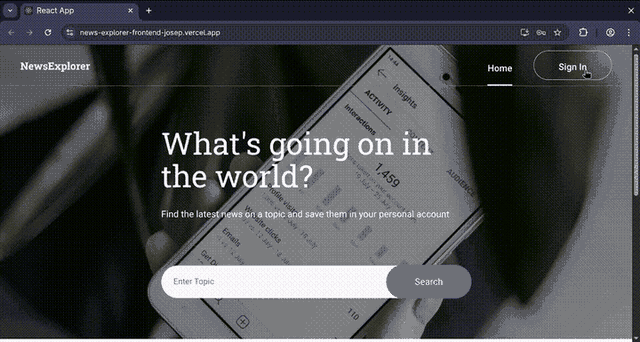
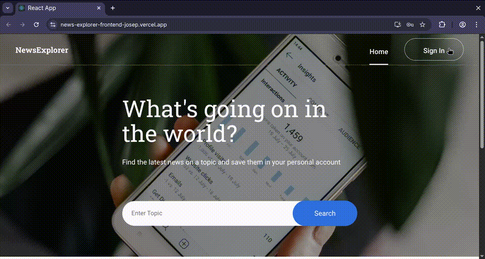
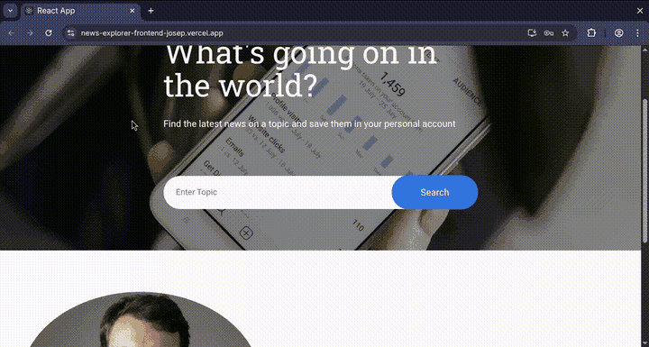

# News Explorer — Frontend

React frontend for the News Explorer app. Users can search for news articles via keyword, register and log in, and save articles to their personal account.

🔗 **Backend repo:** [news-explorer-backend](https://github.com/JosepArrufat/news-explorer-backend)

## Live Demo

- Frontend: [https://news-explorer-frontend-josep.vercel.app/](https://news-explorer-frontend-josep.vercel.app/)
- Backend API: [https://news-explorer-backend-ev2z.onrender.com](https://news-explorer-backend-ev2z.onrender.com)

## Demo Flow

The GIFs below show the full user journey in order:

1. Sign up
   - 
2. Log in
   - 
3. News search
   - 
4. Save one article
   - 

---

## Features

- Keyword-based news search powered by the [NewsAPI](https://newsapi.org/)
- User registration and login with JWT authentication
- Save and delete articles from a personal saved news page
- Protected routes — saved news page is only accessible when logged in
- Responsive layout with mobile navigation
- Frontend talks to the backend API for auth, saved articles, and NewsAPI proxy search

---

## Tech Stack

- React 18
- React Router v6
- CSS Modules
- NewsAPI (external)
- REST API communication with the backend

---

## Components

| Component | Description |
|---|---|
| `App` | Root component, manages global state and routing |
| `Header` | Navigation bar with auth state |
| `SearchForm` | Keyword input to trigger news search |
| `NewsCard` | Individual article card with save/delete action |
| `News` | Grid of news cards |
| `SavedNewsInfo` | Summary of saved articles for logged-in user |
| `Popup` | Login and register modal |
| `ProtectedRoute` | Restricts access to authenticated users |
| `Loader` | Loading indicator during API calls |
| `NoResults` | Shown when search returns nothing |
| `MobileNavBar` | Navigation for mobile viewports |
| `Footer` | Site footer |

---

## Getting Started

### Prerequisites

- Node.js 16+
- The backend running locally or deployed — see [news-explorer-backend](https://github.com/JosepArrufat/news-explorer-backend)

### Install and run

```bash
git clone https://github.com/JosepArrufat/news-explorer-frontend.git
cd news-explorer-frontend
npm install
npm start
```

The app runs on `http://localhost:3000` by default.

---

## Environment

Make sure the API base URL in the `utils/` config points to your backend instance (local or deployed).

The frontend now sends news search requests to the backend proxy endpoint, so the NewsAPI key should live only on the backend.

## How the app works

1. The frontend on Vercel sends sign-in, sign-up, and saved-article requests to the backend on Render.
2. The backend stores saved articles in MongoDB and returns the current user profile.
3. News searches are proxied through the backend, which calls NewsAPI server-side and returns the results to the frontend.

This architecture avoids browser CORS restrictions from NewsAPI and keeps the API key off the client.
